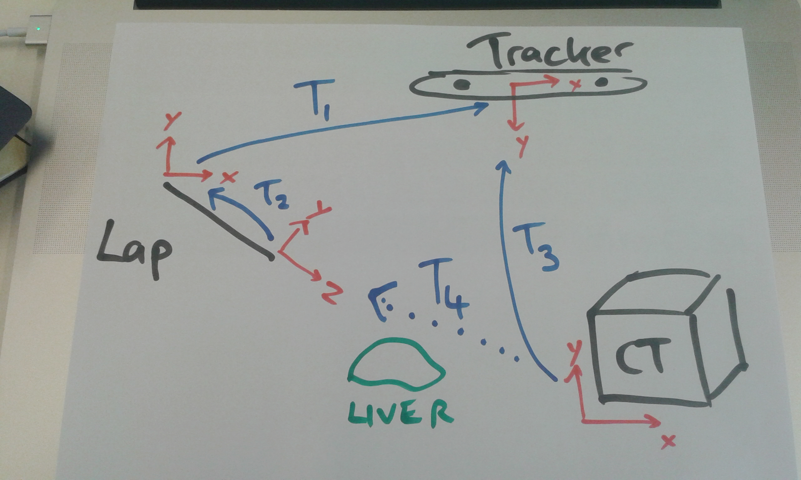
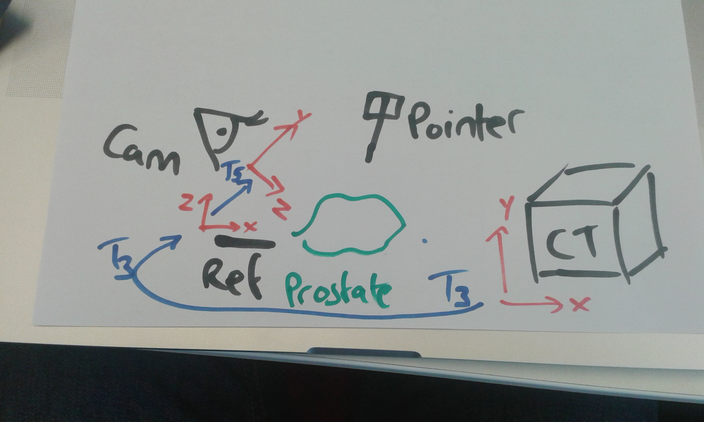

.. highlight:: shell

.. _Demonstration_of_clinical_system:

===============================================
Demo of Laparoscopic Liver Surgery System
===============================================

Here we demonstrate the SmartLiver IGS system.

- The aim is to display CT models on top of live laparoscopic video
- Talk overview of system components

        a. Optical Tracker
        b. Endoscopic stack
        c. NVidia SDI input
- Perform “manual” registration using NiftySLS Liver Surgery plugin
- Perform “ICP” registration using NiftySLS Liver Surgery plugin

(all steps will probably require live demo/assistance).

- Discuss Coordinate Systems
- Compare “Laparoscopic System” with “Home Made” System (see Task 2)

For Laparoscopic System:

    a) Laparoscope is tracked (T1)
    b) Laparoscope has a camera, the intrinsic parameters (zoom, focus, centre of projection) are calibrated, and normally assumed to be fixed. However, it still has a position relative to the tracking balls on the Laparoscope. This relative transformation is called Hand-Eye (from robotic literature), here marked as T2.
    c) When a surface is captured, we transform coordinates into “Tracker Space”, which is synonymous with “World Space”. To render things at the right position on screen, you simply need to mimic the transformations with your rendering system (VTK). In our case, the camera sits in “World Space”. So, once we register CT coordinates to “World Space”, here marked as T3, we can project the CT data, into the virtual camera, here marked as T4. 
    d) So, the basic rendering system is a case of geometry and setting up the rendering engine to mimic the correct geometry.

For “Homemade System”:

    a) We use a webcam. So, the camera intrinsic parameters are calibrated, exactly the same as the laparoscope.
    b) We attach a reference board, with a set of ArUco markers. This defines the world coordinates. One corner is defined to be the origin etc. So, in the diagram below T5 is equivalent to T2 then T1 in Fig 1.
    c) So, if we register CT coordinates to the Reference, this is equivalent to registering the CT coordinates to the tracker in the example above. So, in both cases, these are labeled T3.
    d) This registration is achieved by tracking a separate object (pointer), that can measure points relative to the Reference object? i.e. measures points in “World Space”.
    e) So, this setup is slightly simpler than the laparoscope, but in principal, it's enough to understand how such a system can be set up. Different systems might have slightly different arrangements of rigid body matrices, but the principal is the same.

.. _`Medical Imaging Summer School`: https://medicss.cs.ucl.ac.uk/
.. _`OpenCV` : https://opencv.org/
.. _`VTK` : https://vtk.org/
.. _`SNAPPY`: https://weisslab.cs.ucl.ac.uk/WEISS/PlatformManagement/SNAPPY/wikis/home
.. _`EPSRC`: https://www.epsrc.ac.uk/
.. _`Wellcome EPSRC Centre for Interventional and Surgical Sciences`: http://www.ucl.ac.uk/weiss
