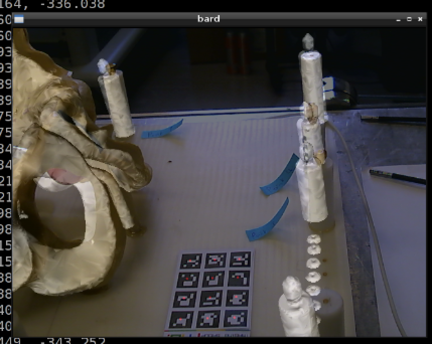

.. highlight:: shell

.. _Introduction:

===============================================
Make your own pointer
===============================================

BARD uses what is known as a fiducial based registration. Fiducial based 
registration is the most widely used registration method in image guided 
interventions, and is often used to validate new methods in research. 
However it is often misunderstood or abused, so
if you learn nothing else from this demo, please learn this.

Fiducial based registration uses a set of identifiable marker points that 
can be reliably located in both the model and patient space. 
Within the data directory there are files based on a CT scan of the
pelvis phantom. 

::
  ls data/PelvisPhantom
    CT_Fiduicial_Markers.txt  
    DeciPelvis.vtk  
    FullPelvis.vtk  
    PhantomCroppedJuly08.gipl.gz 

For now, have a look in the file "CT_Fiduicial_Markers.txt". This is an ordered list 
of the positions of 4 fiducial markers. If we can find the corresponding points on the
physical phantom, we can register the model to the physical world. This can be done by 
minimising the mean distance between the two point sets, using the "Procustes" algorithm.

Locating fiducial markers in physical space is usually done with a pointer, which 
consists of some tracking markers attached to a tipped instrument. You may have seen some
examples of clinical trackers in our lab. For BARD we shall make and calibrate our own 
pointer, using the "pointer" markers, a pen, some cardboard and some sort of adhesive.

Now run this:
::
  python sksurgerybard.py --config config/pointer_markers.json

This will dump tracking matrices for the pointer into the folder ~/BARD.  

::
  python bardPivotCalibration.py --help
  python bardPivotCalibration.py --input ~/BARD

which will calculate a matrix, whose translational component is the offset of the pointer tip from the origin of the pointer model.

Does the translation component look correct? The origin of the pointer coordinate system is the centre of the 2 x 3 pattern (see Fig 1.)

10. Then, edit the pointer.txt file to contain the calibrated pointer position for point ID 9999. The format is 

::
  pointId x0 y0 z0 x1 y1 z1 x2 y2 z2 x3 y3 z3 x4 y4 z4

where point zero is the centre of the tag, followed by the 4 corners. Here we are using a dummy tag ID (9999) to represent the tip, so the centre and corners can all be the same point.

If the pivot calibration looks inaccurate, simply work out the tip position by measuring it. The origin is the centre of the pattern, and the x and y axes are aligned with the tags (if you copied Fig 1.)

11. For each point you want to measure, you should clear down (delete) the contents of ~/BARD (or write the data to a new folder). For each point run:

:: 
  bard -w ~/build/BARD/Data/ref.txt -i ~/build/BARD/Data/intrinsics.txt -x 1280 -y 720 -p ~/build/BARD/Data/pointer.txt -t -d ~/BARD

(which if you compare with step 8, you are recording the tip position instead of the matrix).

Control-C to kill the program each time, and the last generated file will contain the location of the pointer tip. So, you can measure the position in world coordinates of the prostate phantom fiducials.

12. Create a plain text-file containing the coordinates of the prostate phantom fiducials. The file BARD/Data/CT.txt has 4 markers. These markers have been labeled on the phantom. You must measure the points using the tracked pointer, in the same order. You should end up with a file, of the same format as CT.txt, containing the corresponding world coordinates, lets call it world.txt.

13. Compute the registration of CT points in CT.txt to your world points. 

::
  bardProcrustes -f world.txt -m CT.txt -o register.txt

So here -f stands for "fixed" points, also called "target" points in the literature, and -m stands for "moving" points, also called "source" points in the literature.

14. Finally, we should be able to render the prostate CT model, overlaid on the live video using the following:

::
  bard -w ~/build/BARD/Data/ref.txt -i ~/build/BARD/Data/intrinsics.txt -x 1280 -y 720 –m pelvis.vtk –a registration.txt

As the reference board is attached to the phantom, you should be able to move the camera, and observe the prostate model, overlaid on the video from different angles, as long as the tracking markers are in view.

15. Step through the registration process another 2 times, to see how repeatable it is. What is the mean FRE from your 3 attempts?

.. image:: overlat_02.png
  :height: 400px
  :alt: Screenshot after registration. FRE=12mm
  :align: center

.. _`Medical Imaging Summer School`: https://medicss.cs.ucl.ac.uk/
.. _`OpenCV` : https://opencv.org/
.. _`VTK` : https://vtk.org/
.. _`SNAPPY`: https://weisslab.cs.ucl.ac.uk/WEISS/PlatformManagement/SNAPPY/wikis/home
.. _`EPSRC`: https://www.epsrc.ac.uk/
.. _`Wellcome EPSRC Centre for Interventional and Surgical Sciences`: http://www.ucl.ac.uk/weiss
