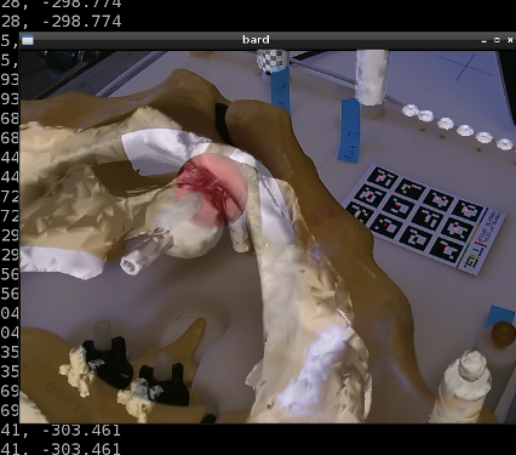

.. highlight:: shell

.. _Register_and_Overlay:

=============================
Register and Overlay Model
=============================

Create a plain text-file containing the coordinates of the prostate phantom fiducials, in the same order and format as data/PelvisPhantom/CT_Fiduicial_Markers.txt. 

You can do this by running 

::

  python sksurgerybard.py --config config/pointer_markers.json

These markers have been labeled on the phantom. You must measure the points using the tracked pointer, in the same order. To do this, you can place the pointer tip at each fiducial and press "d" to record the position.

This should output the files into whatever output file you specified. These points can now be copied and pasted into the world.txt file.
You should end up with a file, of the same format as CT_Fiduicial_Markers.txt, containing the corresponding world coordinates, lets call it world.txt.

Compute the registration of CT points in CT_Fiduicial_Markers.txt to your world points, run this;
::

  python bardProcrustes.py -f data/PelvisPhantom/world.txt -m data/PelvisPhantom/CT_Fiduicial_Markers.txt -o output_file.txt

So here -f stands for "fixed" points, also called "target" points in the literature, and -m stands for "moving" points, also called "source" points in the literature.
This will output a rotation, a translation, and Fiducial Registration Error.
The full transformation matrix, containing rotation and translation vectors will be saved to the output_file.txt

::

  R11 R12 R13 T1
  R21 R22 R23 T2
  R31 R31 R33 T3
  0   0   0   1

and edit config/reference_with_model.json to use your new file instead of data/id.txt.

Rerun BARD using this configuration file, using:
::

   python sksurgerybard.py --config config/reference_with_model.json

and see what happens.

 - Is it a good registration?
 - What happens when you move the camera? 
 - What could you do to make it better?
 - How could you measure the accuracy?

Repeat this process a few times. Is there any correlation between the Fiducial Registration Error 
and the apparent accuracy? Make some videos and discuss. Here's a couple we made earlier.

.. image:: overlay_01.png
  :height: 400px
  :alt: Screenshot after registration. FRE=12mm
  :align: center

