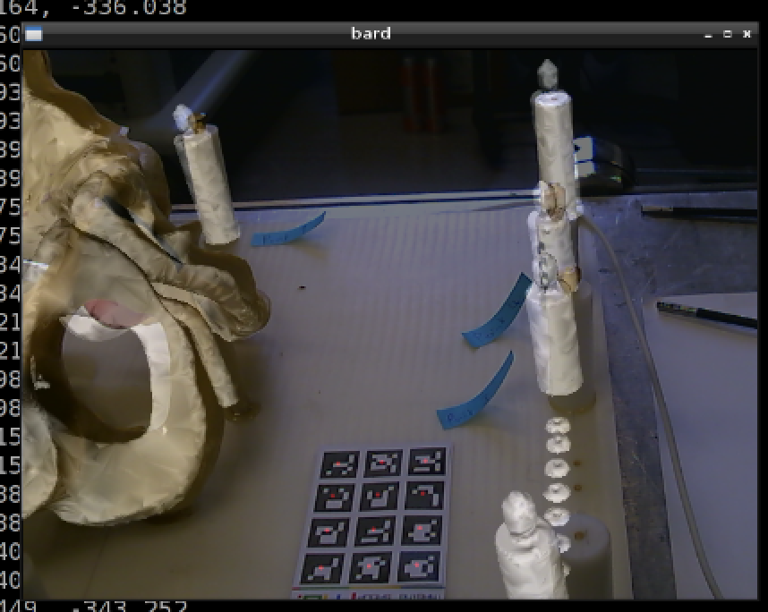

.. highlight:: shell

.. _Introduction:

===============================================
Build Your Own Image Guided Surgery System
===============================================
1. Obtain a suitable test phantom, in this case a prostate phantom.

.. image:: phantom_01.png
  :height: 400px
  :alt: A prostate phantom, for which we have a CT scan, a reference marker, and a pointer.
  :align: center

2. Select a USB camera. There are 2 spare in the TIG lab, or in Matt's office 8.24.

3. Compile BARD in DEBUG mode using CMake and your compiler of choice. Basic build instructions are in the README.md in the repository containing this document.

4. Calibrate USB camera.

  (a) Take 5-20 pictures of chessboard using

::
  bardGrabber -d <output_dir>

hitting the ‘d’ key to dump a video image to the output folder.

  (b) Run the following, to get intrinsic parameters and distortion parameters

::
  bardCameraCalibration -help
  bardCameraCalibration -x 9 -y 7 -s 24 -o intrinsics.txt *.png 

(filling in appropriate parameters: so -x gives the number of chessboard squares in the x direction, -y the number of chessboard squares in the y direction and -s gives the size of each chessboard square in millimetres)

(c) Repeat calibration 2,3,4 times – which parameters vary the most?

  5. Attach reference object (3 x 4 barcode pattern) to the phantom. This defines the “world” coordinate system.

6. Run the following, and check that the USB camera can track the reference marker

   bard -w ~/build/BARD/Data/ref.txt -i ~/build/BARD/Data/intrinsics.txt -x 1280 -y 720

where the -w option specifies a list of 3D coordinates and point IDs for each tag, and -x and -y specify the x and y size of the image coming from your webcam. Adjust as appropriate. The 2D/3D registration algorithm uses OpenCV cv::solvePnP algorithm to match 3D points to 2D points through a pinhole camera model. 

7. In order to display CT data on-top of video, we need to register CT coordinates to “world” coordinates.

8. Open pelvis.vtk and pelvis.nii in NiftyView / ITKSnap / Slicer3D. Identify the fiducials, and note their 3D position in CT coordinates. See file ~/build/BARD/Data/CT.txt

9. Do pivot calibration of a pointer. Use the second 2 x 3 barcode pattern to make a pointer from something like a pen. See Fig 1.

::
  bard -w ~/build/BARD/Data/ref.txt -i ~/build/BARD/Data/intrinsics.txt -x 1280 -y 720 -p ~/build/BARD/Data/pointer.txt -r -d ~/BARD

This will dump tracking matrices for the pointer into the folder ~/BARD. Put all tracking matrices into 1 file. 

::
  bardPivotCalibration --help
  bardPivotCalibration --matrixDirectory ~/BARD

or 

::
  bin/bardPivotCalibration -i trackingMatrices.txt -o pivot.txt

which will calculate a matrix, whose translational component is the offset of the pointer tip from the origin of the pointer model.

Does the translation component look correct? The origin of the pointer coordinate system is the centre of the 2 x 3 pattern (see Fig 1.)

10. Then, edit the pointer.txt file to contain the calibrated pointer position for point ID 9999. The format is 

::
  pointId x0 y0 z0 x1 y1 z1 x2 y2 z2 x3 y3 z3 x4 y4 z4

where point zero is the centre of the tag, followed by the 4 corners. Here we are using a dummy tag ID (9999) to represent the tip, so the centre and corners can all be the same point.

If the pivot calibration looks inaccurate, simply work out the tip position by measuring it. The origin is the centre of the pattern, and the x and y axes are aligned with the tags (if you copied Fig 1.)

11. For each point you want to measure, you should clear down (delete) the contents of ~/BARD (or write the data to a new folder). For each point run:

:: 
  bard -w ~/build/BARD/Data/ref.txt -i ~/build/BARD/Data/intrinsics.txt -x 1280 -y 720 -p ~/build/BARD/Data/pointer.txt -t -d ~/BARD

(which if you compare with step 8, you are recording the tip position instead of the matrix).

Control-C to kill the program each time, and the last generated file will contain the location of the pointer tip. So, you can measure the position in world coordinates of the prostate phantom fiducials.

12. Create a plain text-file containing the coordinates of the prostate phantom fiducials. The file BARD/Data/CT.txt has 4 markers. These markers have been labeled on the phantom. You must measure the points using the tracked pointer, in the same order. You should end up with a file, of the same format as CT.txt, containing the corresponding world coordinates, lets call it world.txt.

13. Compute the registration of CT points in CT.txt to your world points. 

::
  bardProcrustes -f world.txt -m CT.txt -o register.txt

So here -f stands for "fixed" points, also called "target" points in the literature, and -m stands for "moving" points, also called "source" points in the literature.

14. Finally, we should be able to render the prostate CT model, overlaid on the live video using the following:

::
  bard -w ~/build/BARD/Data/ref.txt -i ~/build/BARD/Data/intrinsics.txt -x 1280 -y 720 –m pelvis.vtk –a registration.txt

As the reference board is attached to the phantom, you should be able to move the camera, and observe the prostate model, overlaid on the video from different angles, as long as the tracking markers are in view.

15. Step through the registration process another 2 times, to see how repeatable it is. What is the mean FRE from your 3 attempts?

.. image:: overlat_02.png
  :height: 400px
  :alt: Screenshot after registration. FRE=12mm
  :align: center

.. _`Medical Imaging Summer School`: https://medicss.cs.ucl.ac.uk/
.. _`OpenCV` : https://opencv.org/
.. _`VTK` : https://vtk.org/
.. _`SNAPPY`: https://weisslab.cs.ucl.ac.uk/WEISS/PlatformManagement/SNAPPY/wikis/home
.. _`EPSRC`: https://www.epsrc.ac.uk/
.. _`Wellcome EPSRC Centre for Interventional and Surgical Sciences`: http://www.ucl.ac.uk/weiss
